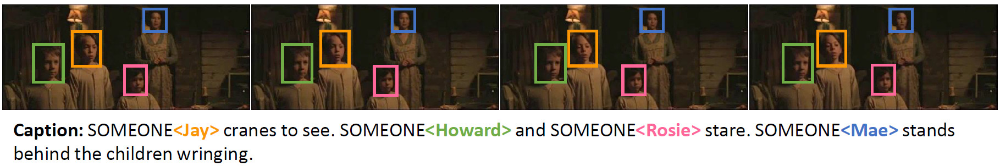
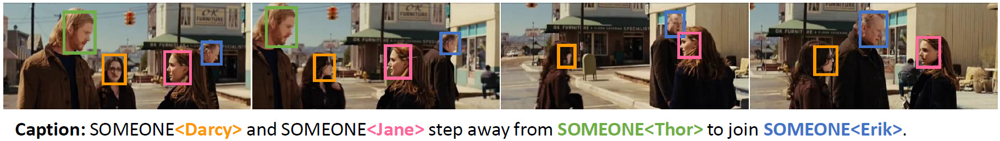
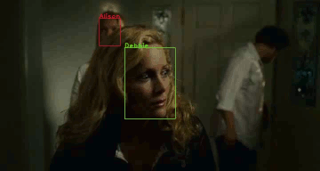

# M-VAD Names Dataset

This repository contains the latest version of the M-VAD Names Dataset, introduced in the following papers:

Stefano Pini, Marcella Cornia, Lorenzo Baraldi, Rita Cucchiara  
_[Towards Video Captioning with Naming: a Novel Dataset and a Multi-Modal Approach](http://imagelab.ing.unimore.it/imagelab/pubblicazioni/2017_ICIAP_Naming.pdf)_  
International Conference on Image Analysis and Processing, 2017

Stefano Pini, Marcella Cornia, Federico Bolelli, Lorenzo Baraldi, Rita Cucchiara  
_[M-VAD Names: a Dataset for Video Captioning with Naming](https://link.springer.com/article/10.1007/s11042-018-7040-z)_  
Multimedia Tools and Applications, 2018


## Dataset Overview

We collect and release a new set of annotations for the Montreal Video Annotation Dataset
([M-VAD](https://mila.quebec/en/publications/public-datasets/m-vad/)).





The dataset contains the annotations of the characters' visual appearances, in the form of tracks of face bounding
boxes, and the associations with the characters' textual mentions, when available.
We detect and annotate the visual appearances of characters in each video clip of each movie through a 
semi-automatic approach.
The released dataset contains more than 24k annotated video clips, including 63k visual tracks and 34k textual 
mentions, all associated with their character identities.

The dataset can be downloaded [here](https://github.com/aimagelab/mvad-names-dataset/releases/tag/1.0).  
_By downloading the dataset, you declare that you will use it for research and educational purposes only, any commercial
 use is prohibited._

Please cite with the following articles:

```
@article{pini2018mvad,
  title={{M-VAD Names: a Dataset for Video Captioning with Naming}},
  author={Pini, Stefano and Cornia, Marcella and Bolelli, Federico and Baraldi, Lorenzo and Cucchiara, Rita},
  journal={Multimedia Tools and Applications},
  year={2018}
}
```

```
@inproceedings{pini2017towards,
  title={{Towards Video Captioning with Naming: a Novel Dataset and a Multi-Modal Approach}},
  author={Pini, Stefano and Cornia, Marcella and Baraldi, Lorenzo and Cucchiara, Rita},
  booktitle={International Conference on Image Analysis and Processing},
  year={2017}
}
```

Please note that the original M-VAD video clips are not included in this dataset and can be downloaded from the official
[M-VAD website](https://mila.quebec/en/publications/public-datasets/m-vad/). 


### Technical details

The dataset file is a pickle object containing a python dictionary, structured as follows:

```
mvad-names.pkl
 └── <MOVIE>
      ├── 'characters'
      |    └── <CHARACTER>
      |         └── 'DVS<CLIP-ID>'  -> tracks
      └── 'videos'
           └── 'DVS<CLIP-ID>'
                └── <CHARACTER>  -> tracks
```

where `tracks` is a list of bounding boxes containing the face of the character in the form `(frame-id, x_min, y_min, x_max, y_max)`.


### Dataset splits

Original M-VAD training, validation, and test sets are obtained by splitting the 92 movies in three disjoint parts.
However, when considering the characters' identities, video clips of the same movie have to be in every split, so that 
the algorithms can learn the visual appearance of the characters on the training set and apply it on the 
validation and test set.

We release official training, validation, and test set for the M-VAD Names dataset which tend to respectively have 
80%, 10%, and 10% of video clips of each movie, of video clips of each character, of video clips with one mention, and 
of video clips with two or more mentions.

|                   | Overall   | Avg. per movie    |
| ----              | :-----:   | :-----:           |
| Train videos      | 19,023    | 207               |
| Validation videos | 2,976     | 32                |
| Test videos       | 2,836     | 31                |

Official splits are available, along with the M-VAD Names dataset, in the [Release section](https://github.com/aimagelab/mvad-names-dataset/releases/tag/1.0). 


### Dataset Visualization

<table>
 <tr>
  <td align="center" valign="center"></td><td align="center"></td>
 </tr>
 <tr>
  <td align="center"></td><td align="center"></td>
 </tr>
</table>

We provide a visualization tool to show the dataset annotations.

Please install the required packages with:

```
pip install -r requirements.txt
```

Visualize the entire dataset:

```
python visualize.py --mvad_path <M-VAD-path> --mvad_names_path <M-VAD-Names-path>
```

where `<M-VAD-path>` corresponds to the M-VAD dataset folder which contains the video clips in a specific folder for
each movie and `<M-VAD-Names-path>` corresponds to the M-VAD Names file path. 

Visualize a specific clip of a movie:

```
python visualize.py --mvad_path <M-VAD-path> --movie <movie-folder> --clip <clip-ids>
```

Save the results in place of visualizing them:

```
python visualize.py --mvad_path <M-VAD-path> --save_results
``` 

For instance, the following code saves the visualizations of the clips `DVS123`, `DVS198` of the movie `IRON_MAN_2`:

```
python visualize.py --mvad_path ./M-VAD --mvad_names_path ./mvad-names.pkl --movie IRON_MAN_2 --clip "123 198" --save_results
```


## Refined M-VAD Captions

Along with the M-VAD Names dataset, we release an extended version of the original M-VAD movie descriptions. 
In particular, during the annotation process, we found that several annotated characters were not tagged as "someone"
in the original M-VAD captions but were mentioned with their proper names.
To fix this problem, we add new annotations (i.e. new "someone" tags) in every movie caption for each mentioned 
character that is not annotated in the original M-VAD, but that we have correctly annotated in the previous stage of
the process. Overall, we fix 1,253 M-VAD descriptions by adding 116 unique characters that appeared in the original 
captions but that were not tagged as "someone".

Refined M-VAD captions can be downloaded in the [Release section](https://github.com/aimagelab/mvad-names-dataset/releases/tag/1.0).
